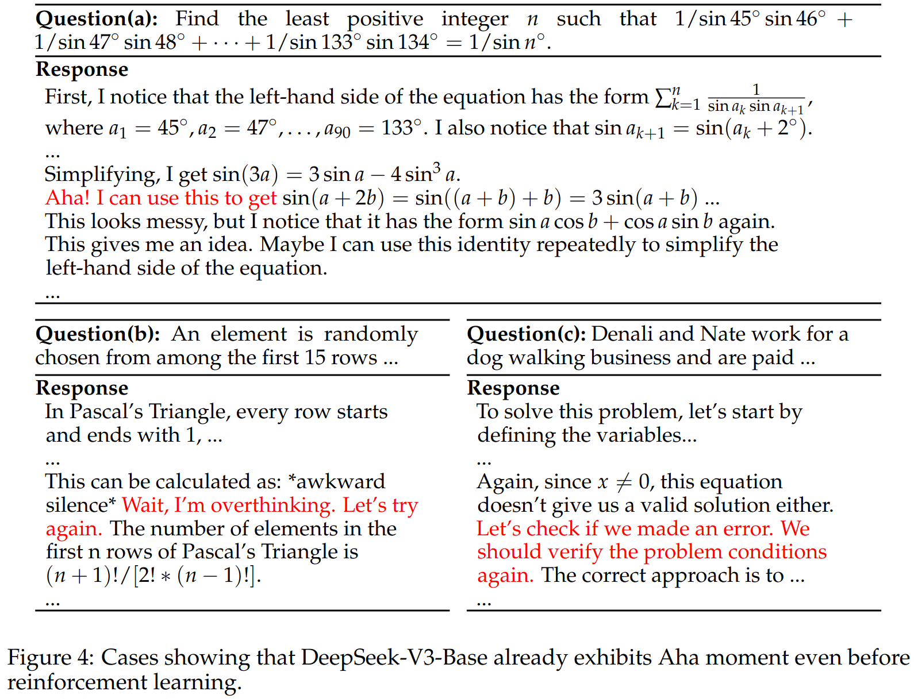
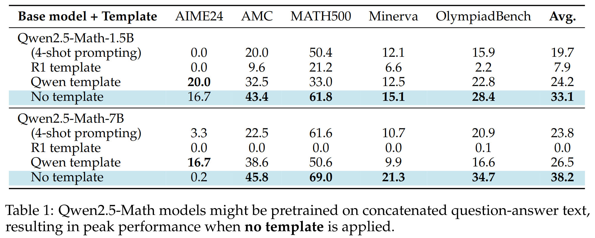
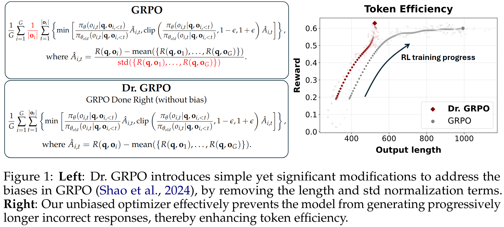
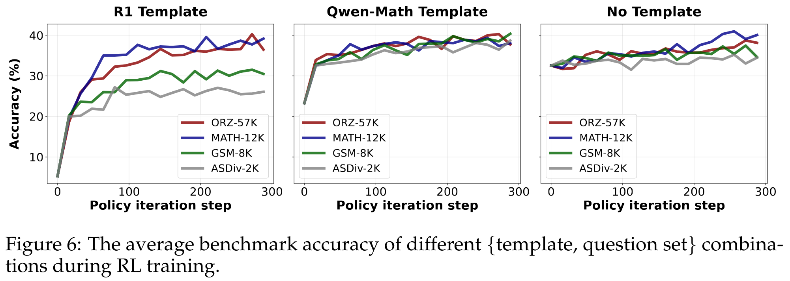
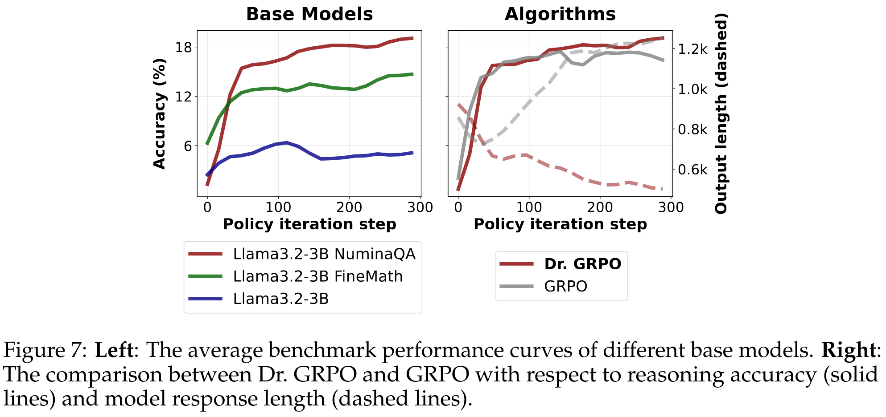
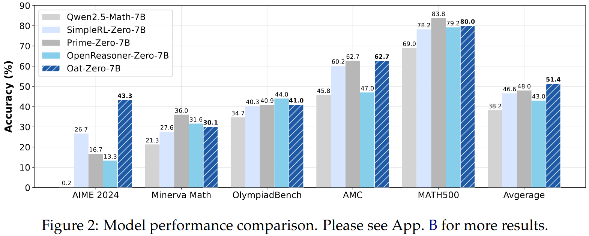

<div align="center">

# Understanding R1-Zero-Like Training: A Critical Perspective

[](./understand-r1-zero.pdf)

[](https://github.com/sail-sg/understand-r1-zero)  [](https://huggingface.co/collections/sail/oat-zero-understanding-r1-zero-like-training-67dcdb07b9f3eb05f1501c4a)

<div align="center" style="font-family: Arial, sans-serif;">
  <p>
    <a href="#updates" style="text-decoration: none; font-weight: bold;">🎉 Updates</a> •
    <a href="#links" style="text-decoration: none; font-weight: bold;">🔗 Links</a> •
    <a href="#tldr" style="text-decoration: none; font-weight: bold;">📖 TL;DR</a>
  </p>
  <p>
    <a href="#usage" style="text-decoration: none; font-weight: bold;">💻 Usage </a> •
    <a href="#citation" style="text-decoration: none; font-weight: bold;">🍊 Citation</a> •
    <a href="#acknowledgement" style="text-decoration: none; font-weight: bold;">🌻 Acknowledgement</a>
  </p>
</div>

</div>

## Updates

* 21/03/2025: 🎉 We release our paper, models and codebase. Our R1-Zero training is implemented with 🌾 [Oat](https://github.com/sail-sg/oat), a highly modular, research-friendly and efficient LLM RL framework.

## Links

* **Understanding R1-Zero-Like Training**
  * 📄 [Paper](./understand-r1-zero.pdf)
  * 🤗 [Models](https://huggingface.co/collections/sail/oat-zero-understanding-r1-zero-like-training-67dcdb07b9f3eb05f1501c4a)

* **There May Not Be Aha Moment in R1-Zero-like Training — A Pilot Study**
  * 📄 [Blog](https://oatllm.notion.site/oat-zero)
  * 💻 [Code](https://github.com/sail-sg/oat-zero)

* **OAT: A research-friendly framework for LLM online alignment**
  * 💻 [Codebase](https://github.com/sail-sg/oat)

## TL;DR
To understand R1-Zero-like training, we critically examine two core components: **base models**
and **reinforcement learning**. We highlight our findings below.

### On base models:
1. **DeepSeek-V3-Base already exhibit "Aha moment"**.
<p align="center">
  
</p>

2. As the popular choice for R1-Zero-like training, Qwen2.5 base models demonstrate strong reasoning capabilities
even **without** prompt templates: the average benchmark scores improve by **~60%** (compared to the traditional 4-shot prompting)!
<p align="center">
  
</p>

### On reinforcement learning:

3. GRPO leads to **biased** optimization! We propose a simple fix that improves token efficiency
while maintaining reasoning performance, termed as Dr. GRPO (GRPO **D**one **R**ight).
<p align="center">
  
</p>

4. In R1-Zero-like training, the template and the question set perform a duet to affect the RL dynamics
   * (Left Plot) For Qwen2.5-Math-1.5B, a mismatched template (e.g., R1 template) in fact **destructs the reasoning capabilities before RL reconstructing it**. This makes the improvement impressive on the surface.
   * (Middle Plot) However, if a template does not deviate from the pretraining distribution too far, even a small and completely o.o.d. question set (e.g., GSM8K) could induce the reasoning ability equally well, by reinforcing correct reasoning behaviors instead of infusing new knowledge.
<p align="center">
  
</p>

5. Beyond Qwen, Llama can also be RL-tuned from base models. In this case, domain-specific pretraining will improves RL ceiling.
   * (Right Plot) GRPO can even make Llama with math knowledge "Aha" by increasing the output length; however, it is likely due to its length bias, which can be removed by Dr. GRPO.
 <p align="center">
  
</p>

### Our minimalist R1-Zero recipe:
Our analysis suggests a minimalist recipe for R1-Zero-like training: 

We RL-tune Qwen2.5-
Math-7B using the (unbiased) Dr. GRPO algorithm on MATH level 3-5 questions with the Qwen-Math template, and achieve state-of-the-art performance with only 27 hours compute on 8× A100 GPUs.
 <p align="center">
  
</p>

If you are interested in more details, please check out our [paper](./understand-r1-zero.pdf)!

## Usage

### Install

We recommend a clean `python==3.10` environment for development.

```diff
# Install vllm & oat, the LLM RL framework we developed r1-zero training on.
pip install vllm==0.7.2 && pip install oat-llm==0.0.9

# Install this package locally to use the math grader.
git clone git@github.com:sail-sg/understand-r1-zero.git && cd understand-r1-zero
pip install -e .
```

### Training

We implement R1-Zero training by extending Oat's Learner and Actor components. Please see [train_zero_math.py](./train_zero_math.py) for a step-by-step guide.

```diff
# Patch LD_LIBRARY_PATH to avoid dependency errors:
export LD_LIBRARY_PATH=$(python -c "import sysconfig; print(sysconfig.get_config_var('LIBDIR'))"):$LD_LIBRARY_PATH

# Run the experiment (tested on 8 x A100-40G) with Dr. GRPO:
# (change to `--critic_type grpo` for running GRPO)
python train_zero_math.py \
    --critic_type drgrpo \
    --gpus 8 \
    --enable_prefix_caching \
    --collocate \
    --vllm_sleep \
    --vllm_gpu_ratio 0.35 \
    --gradient-checkpointing \
    --flash-attn \
    --bf16 \
    --rnd-seed \
    --learning_rate 0.000001 \
    --lr_scheduler constant \
    --num_ppo_epochs 1 \
    --beta 0 \
    --oracle_type reward \
    --oracle math \
    --pretrain Qwen/Qwen2.5-Math-1.5B \
    --prompt_template r1 \
    --zero-stage 2 \
    --ref_offload \
    --prompt_data ./datasets/train/math_12k \
    --train_split train \
    --input_key problem \
    --output_key answer \
    --max-train 9999999 \
    --num_prompt_epoch 20 \
    --prompt_max_length 1024 \
    --num_samples 8 \
    --temperature 1 \
    --top_p 1 \
    --generate_max_length 3000 \
    --save_steps -1 \
    --train_batch_size 128 \
    --rollout_batch_size 128 \
    --rollout_batch_size_per_device 16 \
    --pi_buffer_maxlen_per_device 128 \
    --eval_batch_size 200 \
    --eval_steps 16 \
    --eval_temperature 0 \
    --eval_generate_max_length 3000 \
    --eval_data ./datasets/evaluation_suite \
    --eval_input_key input \
    --use-wb \
    --wb-run-name qwen2.5-Math-1.5b-r1-zero \
    --wb_project oat-zero
```
Please see [here](./examples/) for more example scripts.

### Evaluation
```diff
# Evaluate our models:
python evaluate_model.py --model_name sail/Qwen2.5-Math-7B-Oat-Zero
python evaluate_model.py --model_name sail/Qwen2.5-Math-1.5B-Oat-Zero
python evaluate_model.py --model_name sail/Llama-3.2-3B-Oat-Zero --template r1

# Evaluate baseline models:
python evaluate_model.py --model_name Qwen/Qwen2.5-Math-1.5B
python evaluate_model.py --model_name Qwen/Qwen2.5-Math-7B
python evaluate_model.py --model_name hkust-nlp/Qwen-2.5-Math-7B-SimpleRL-Zero
python evaluate_model.py --model_name PRIME-RL/Eurus-2-7B-PRIME-Zero
python evaluate_model.py --model_name Open-Reasoner-Zero/Open-Reasoner-Zero-7B
```

## Citation

If you find our work useful for your research, please consider citing:
```bibtex
@misc{liu2025understanding,
  title={Understanding R1-Zero-Like Training: A Critical Perspective},
  author={Zichen Liu and Changyu Chen and Wenjun Li and Penghui Qi and Tianyu Pang and Chao Du and Wee Sun Lee and Min Lin},
  year={2025},
  howpublished={\url{https://github.com/sail-sg/understand-r1-zero}},
}
```

## Acknowledgement
* This work is supported by [Sea AI Lab](https://sail.sea.com/) for computing resources.
* The training codes are built on [Oat](https://github.com/sail-sg/oat), which employs [vLLM](https://github.com/vllm-project/vllm), [DeepSpeed](https://github.com/microsoft/DeepSpeed) and [launchpad](https://github.com/google-deepmind/launchpad).
* The base models are from [Qwen2.5-Math](https://huggingface.co/Qwen/Qwen2.5-Math-7B), [Llama](https://huggingface.co/meta-llama/Llama-3.2-3B) and [DeepSeek](https://huggingface.co/deepseek-ai/DeepSeek-V3-Base).
* We thank Qingfeng Lan for his time in thoroughly reviewing our code.
